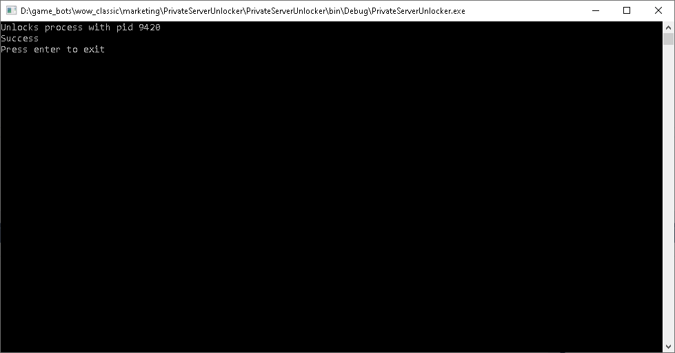

# Zebra - private server lua unlocker

## 

Basic WoW Lua unlocker for Vanilla, BC, WotLK, Cata, MoP and WoD.
Unlocks all protected lua functions. Does not add any.

This is done by turning conditional jump instructions into simple jumps or just NOP slides past the jump instruction.
Programmed in C#. Requires .NET 4.5, which you probably already have.

It is probably not detected atleast on the earlier clients. Use on your own risk.

Just fire up your WoW client and run the application and you will see something like this:



That will unlock all WoW instances.
If you want to just unlock certain WoW instance(s) that can be done by invoking the program from the command line:

```batch
./zebra [PID...]
```
```batch
eg ./zebra 4169
```
```batch
eg ./zebra 4169 6941
```

I have verified that most of the functions are working. But not all of them on every version.
This is what I got so far: <br />
[Protection table](https://creativemind1001.github.io/zebra/protection_table.html)